# Genovance  
🏆 Built for the GenAI Hackathon 2026
## Unified AI Growth Intelligence Engine  

Genovance is a GenAI-powered system that mirrors the real startup growth lifecycle:

**Strategy → Messaging → Conversion Intelligence**

It combines deterministic lead scoring with generative strategic reasoning to simulate real-world growth decision workflows for early-stage founders and growth teams.

---

## 🚀 Problem

Early-stage teams struggle to:

- Design structured, investor-ready campaign strategies  
- Translate positioning into persuasive sales messaging  
- Identify which leads to prioritize  
- Convert engagement signals into actionable insight  

Most tools operate in silos.  
Genovance unifies them into one intelligence workflow.

---

## 🧠 Solution

Genovance integrates three intelligence layers:

### 1️⃣ Strategy Layer  
Generates structured marketing campaign plans using Gemini 2.5 Flash.  
Outputs include market insight, channel rationale, executive-level messaging, and performance metrics.

### 2️⃣ Messaging Layer  
Transforms product inputs into persuasive, outcome-oriented sales positioning using structured prompt engineering.

### 3️⃣ Conversion Intelligence Layer  
Applies a deterministic weighted scoring model to evaluate lead quality, then leverages GenAI to interpret results and recommend strategic next steps.

This hybrid architecture ensures both structured reliability and adaptive reasoning.

---

## 🏗 Architecture Overview

Genovance follows a hybrid intelligence design:

- Deterministic weighted scoring model for structured evaluation  
- Generative AI layer for contextual reasoning and strategic advisory  
- Streamlit-based interactive workflow interface  
- Gemini 2.5 Flash API for structured content generation  
- Fallback handling for API reliability  

This design ensures consistent evaluation while enabling intelligent interpretation.

---

## 🧩 Design Philosophy

Genovance is not a simple text generation tool.

It embeds GenAI into a structured growth lifecycle:

1. Strategic Planning  
2. Messaging Development  
3. Conversion Qualification  
4. AI-Based Interpretation Layer  

This mirrors how real growth teams operate in production environments.

---

## 🔧 Tech Stack

- Python  
- Streamlit  
- Google Gemini 2.5 Flash API  
- dotenv  
- Custom weighted scoring model  

---

📸 Demo Screenshots

Strategy Layer
Campaign strategy generation powered by Gemini.

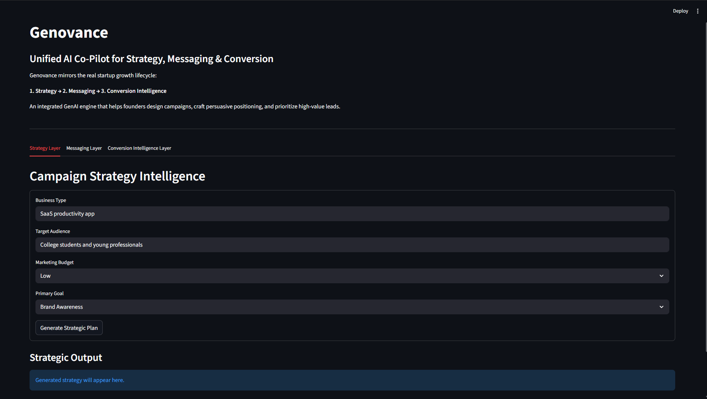
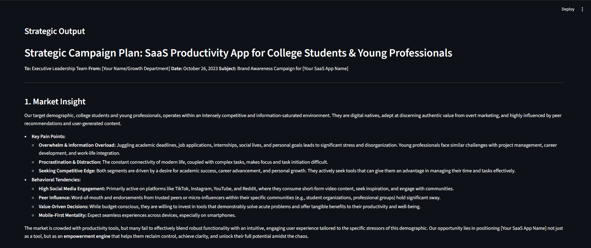
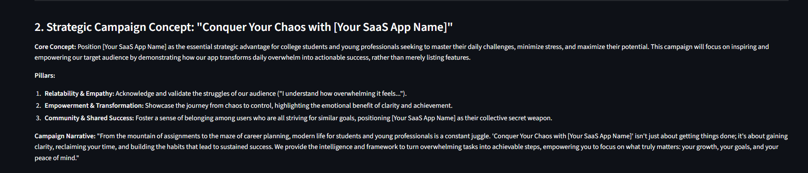
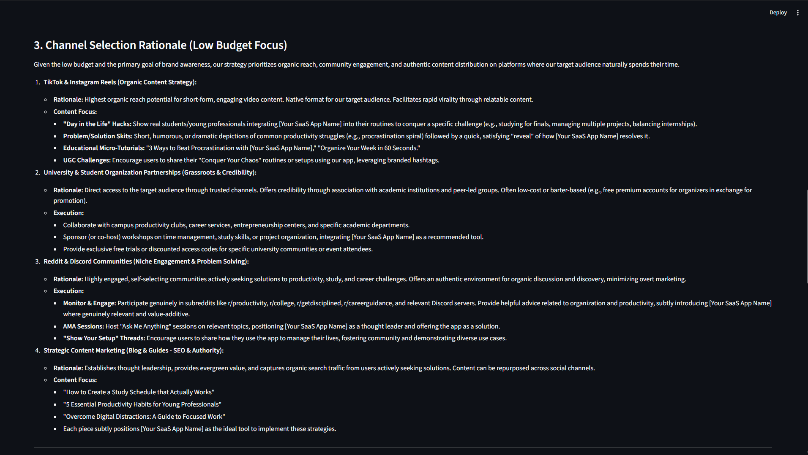
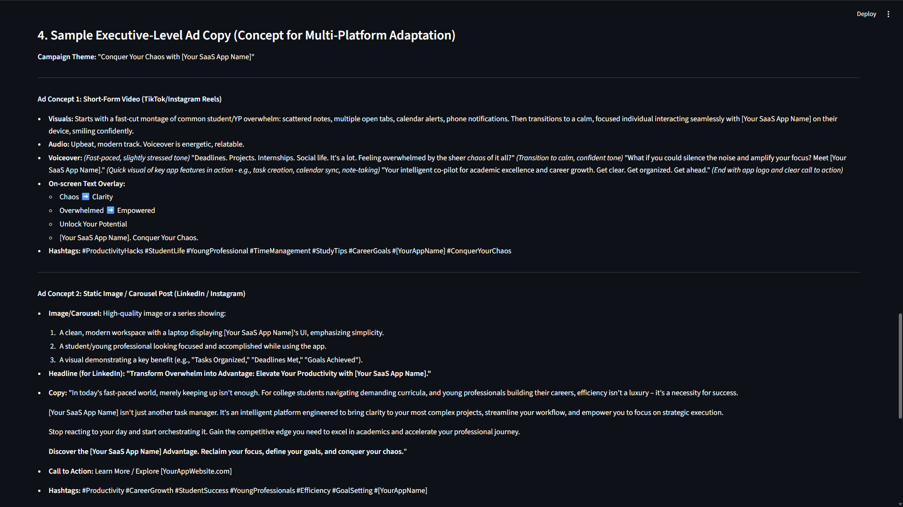
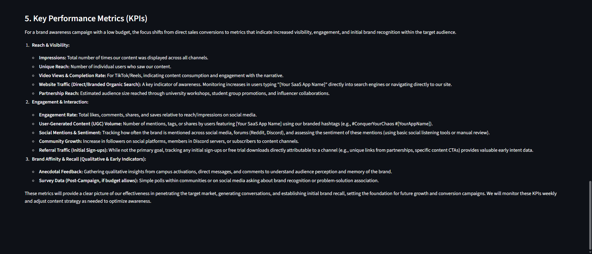

Messaging Layer
Structured AI-generated persuasive positioning.

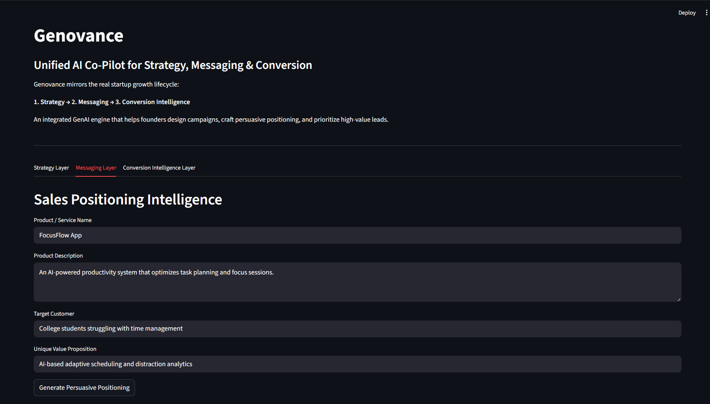
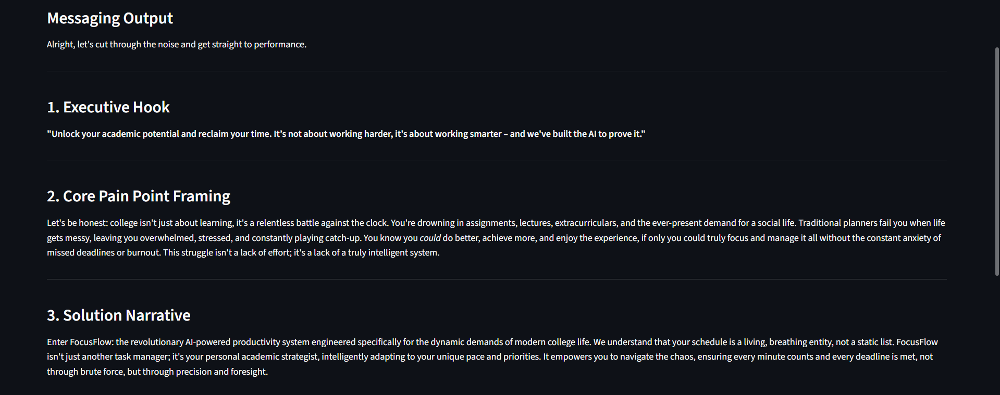
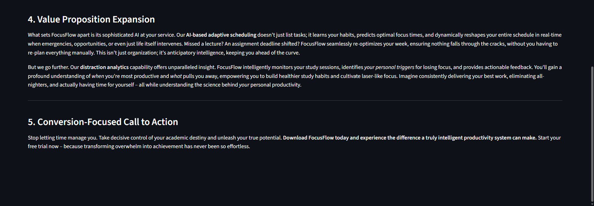

Conversion Intelligence Layer
Hybrid deterministic scoring + AI advisory.

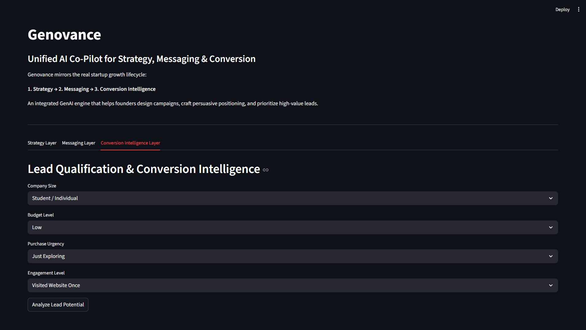
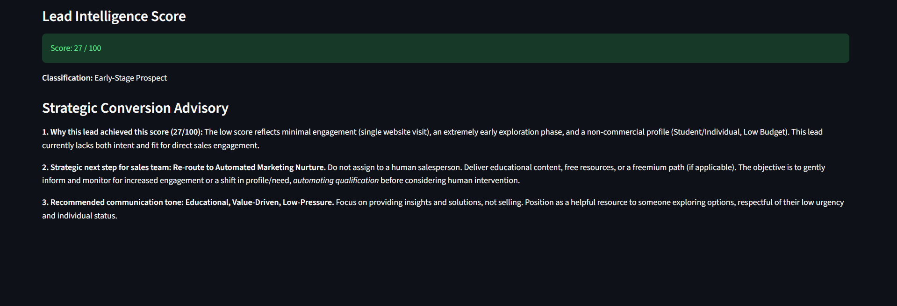 

---

## 🛡 Reliability Considerations

- API quota fallback handling to prevent crashes  
- Separation of deterministic logic and generative reasoning  
- Secure API key management via `.env`  

---

## 🌱 Potential Extensions

- Cross-layer memory to reuse campaign insights inside messaging and lead qualification.
- Adjustable scoring weights to allow users to customize evaluation criteria.
- Export functionality (PDF or structured report download).
- Prompt tuning for industry-specific growth strategies.
- Basic analytics panel to summarize lead distribution across categories.  

---

## 🎯 Why It Matters

Genovance demonstrates how GenAI can move beyond content generation and become embedded in operational decision workflows.

It showcases the integration of structured logic with adaptive intelligence — a key step toward practical AI systems for business growth.
